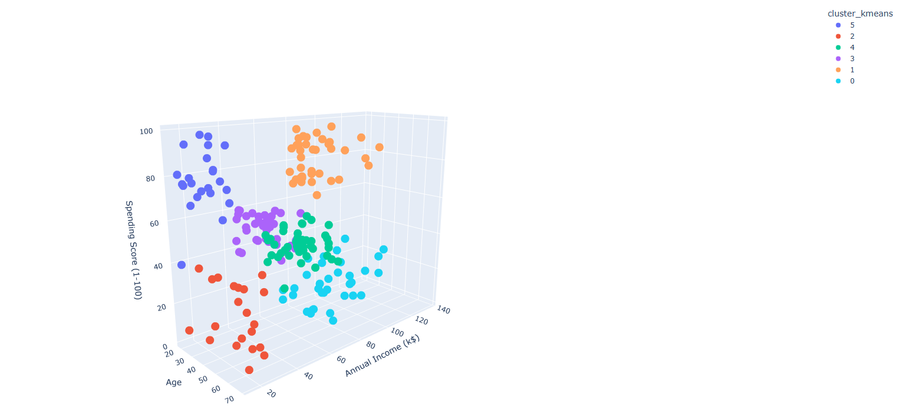
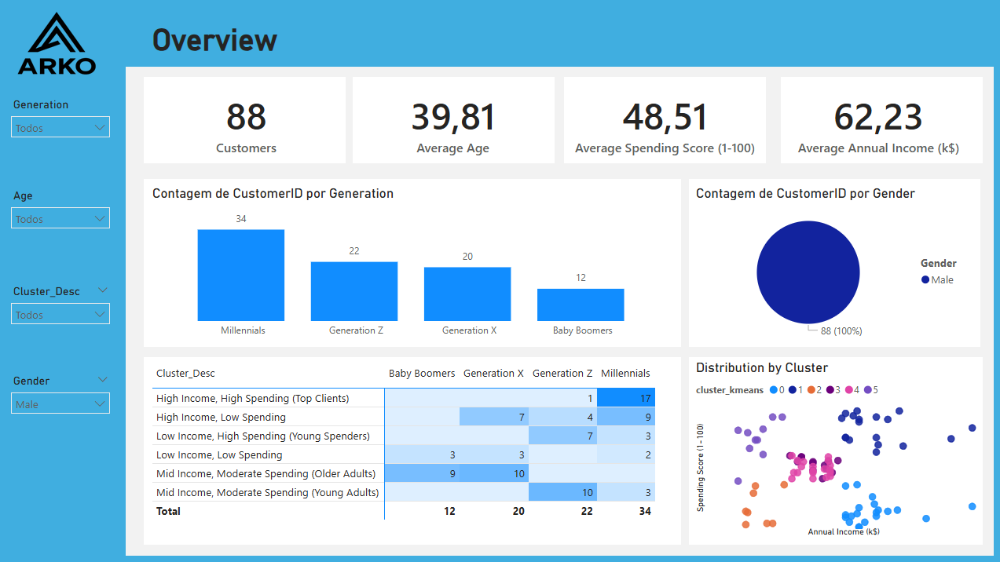

# Customer Segmentation Analysis for Retail (Python + Power BI)

## Executive Summary
Marketing performance was limited due to lack of structured customer segmentation.  
Using Python (EDA + K-Means) and Power BI, I analyzed 200 mall customers and identified **six distinct behavioral groups**.

The analysis shows opportunities to improve engagement and campaign efficiency by:
- Prioritizing **high-income, high-spending customers**
- Re-engaging **high-income but low-spending profiles**
- Using targeted promotions for **young impulsive buyers**

This segmentation provides a clear, data-driven understanding of customer behavior.

---

## Business Problem
The company had basic customer data (age, gender, income, spending score), but **no segmentation** to support marketing decisions.

Stakeholders needed clarity on:
- Who are the main customer groups?
- Which segments offer the highest value?
- Where can engagement and spending be improved?

This project transforms raw customer data into actionable segments.

---

## Methodology
- EDA in Python to analyze age, income and spending score  
- K-Means clustering (**K = 6**) validated with Elbow & Silhouette  
- Behavioral profiling using median values per cluster  
- Power BI dashboard summarizing KPIs, demographics, and cluster distribution  

---

## Skills
**Python:** Pandas, Scikit-Learn, Matplotlib, Seaborn  
**Power BI:** DAX, modeling, KPIs, interactive visuals  
**Machine Learning:** K-Means clustering, scaling, evaluation  

---

## Results & Business Recommendations

#### Final Customer Segments (Median Values)

| Cluster | Age | Annual Income (k$) | Spending Score (1-100) | Cluster Description |
|--------:|-----:|--------------------:|-------------------------:|------------------------------|
| **0** | 41.26 | 88.50 | 16.76 | High Income, Low Spending |
| **1** | 32.69 | 86.54 | 82.13 | High Income, High Spending (Top Clients) |
| **2** | 45.52 | 26.29 | 19.38 | Low Income, Low Spending |
| **3** | 27.00 | 56.66 | 49.13 | Mid Income, Moderate Spending (Young Adults) |
| **4** | 56.33 | 54.27 | 49.07 | Mid Income, Moderate Spending (Older Adults) |
| **5** | 25.00 | 25.26 | 77.61 | Low Income, High Spending (Young Spenders) |

This segmentation makes it possible to direct marketing efforts toward the customers who truly matter.

Key outcomes:
- Campaigns can now be targeted toward **high-value segments**, instead of treating all customers the same  
- **Marketing costs decrease**, since investments can focus on the groups with higher spending potential  
- **Engagement increases** by delivering the right message to the right customer  
- High-income low spenders can be reactivated with personalized strategies  
- Young impulsive buyers become an opportunity for promotional and short-term campaigns  

Overall, this segmentation enables more efficient budget allocation, reduces wasted ad spend, and improves the effectiveness of sales and marketing initiatives.

---

## Next Steps
- Run A/B tests targeting specific clusters  
- Create personalized marketing flows  
- Track cluster performance through KPIs  

---

